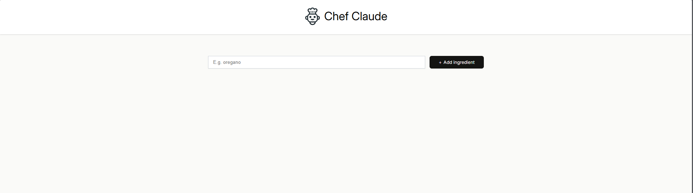
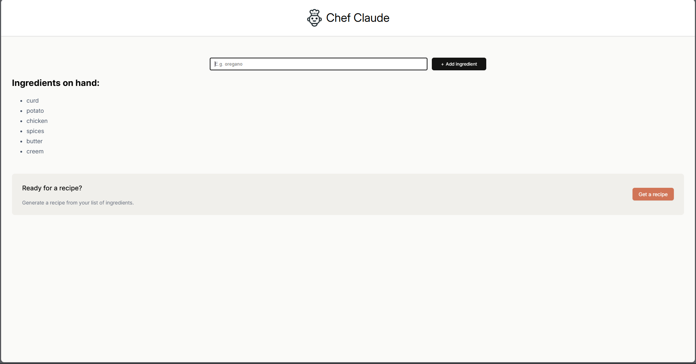
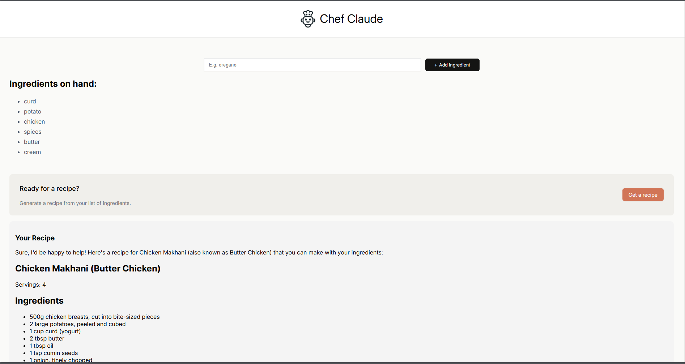
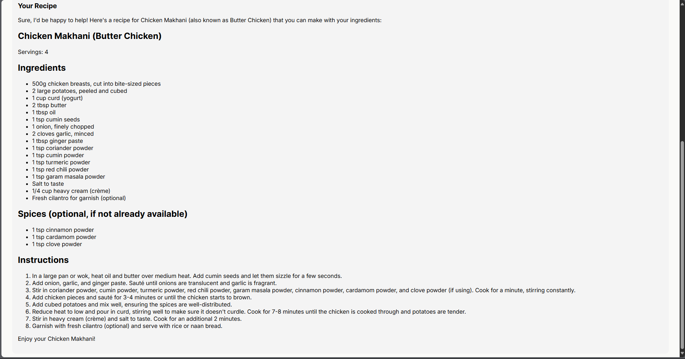

# Cafe Claude - AI Recipe Generator

Cafe Claude is a simple React-based application that uses Hugging Face's Mixtral model to generate creative recipes from a list of user-provided ingredients.

## Features

- Add ingredients dynamically
- Generate a recipe using Hugging Face's Mixtral-8x7B model
- Recipes are displayed in clean, formatted Markdown
- Secure handling of API tokens using environment variables

## Output

## Getting Started

### 1. Clone the Repository

git clone https://github.com/ChaurasiaAdarsh/ChefClaude.git
cd ChefClaude

### 2. Install Dependencies
 
 npm install

### 3. Create a Hugging Face API Token

Sign in at https://huggingface.co

Navigate to Settings > Access Tokens

Generate a token with "read" access

### 4. Set Up Environment Variables

Create a .env file in the root of the project and add your token:

VITE_HF_ACCESS_TOKEN=your_token_here

### Running the App Locally

npm run dev

### Folder Structure

src/
│

├── api.js             # API logic to connect to Hugging Face

├── App.jsx            # Main app component

├── Header.jsx         # Header UI

├── Main.jsx           # Main functionality (form, list, recipe)

├── index.jsx          # Entry point for React

├── index.css          # Global styling

# Environment Variables

To use the Hugging Face API, set your access token:

1. Create a `.env` file in the project root with:

   VITE_HF_ACCESS_TOKEN=your_token_here

2. On Vercel, add the same variable in your project settings under Environment Variables:
   - Name: VITE_HF_ACCESS_TOKEN
   - Value: your_token_here
   - Environment: Production (and Preview if needed)

After updating, restart your dev server or redeploy on Vercel.
